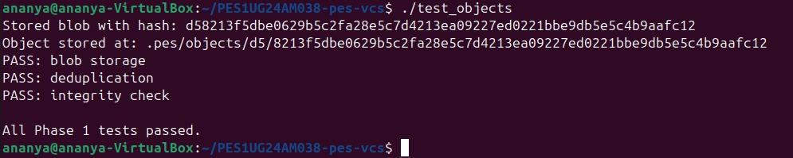
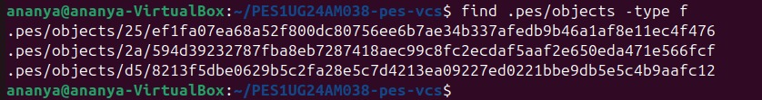
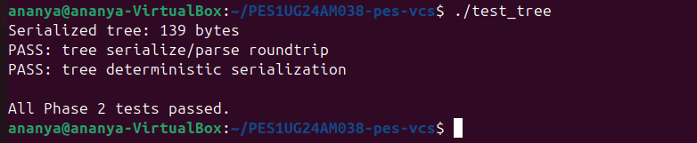
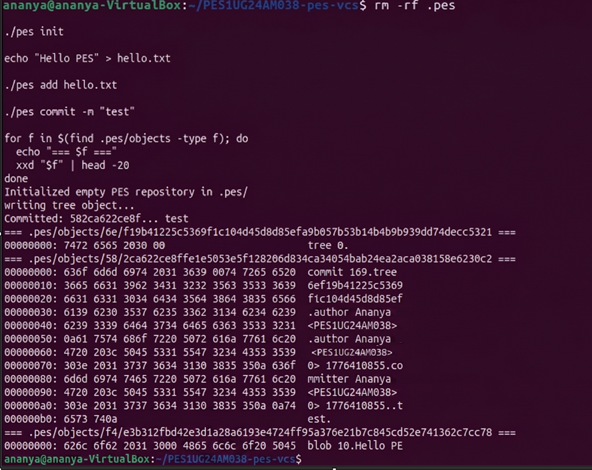
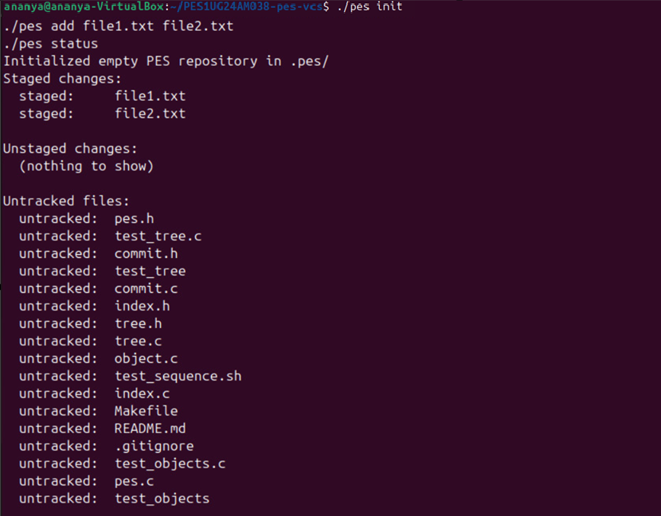
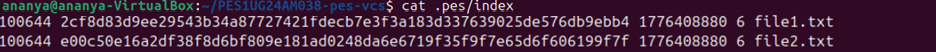
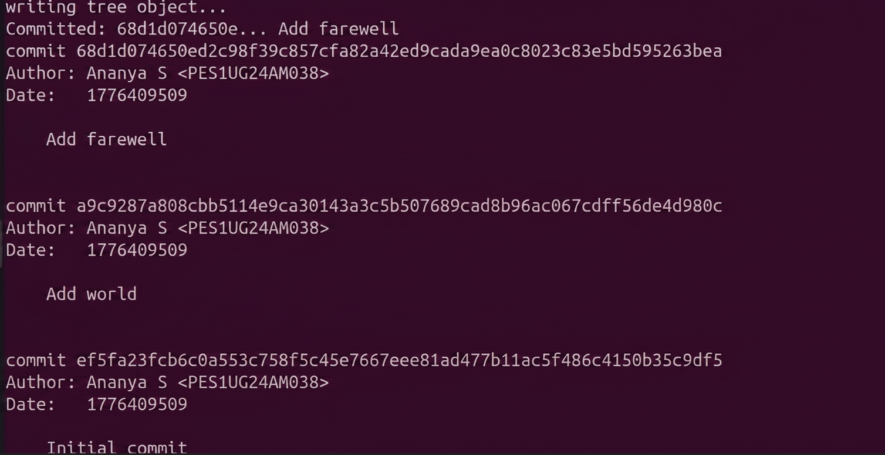
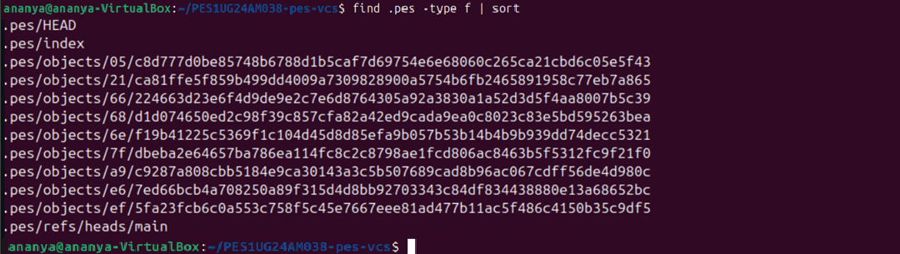
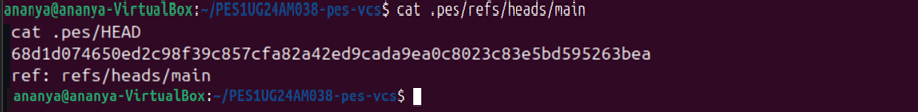

# PES1UG24AM038-VCS Lab Report

**Name:** Ananya S 
**SRN:** PES1UG24AM038
**Platform:** Ubuntu 24.04

---

## Build Instructions

```bash
sudo apt update && sudo apt install -y gcc build-essential libssl-dev
export PES_AUTHOR="Ananya S <PES1UG24AM038>"
make all
```

---

## Phase 1 — Object Storage Foundation

Files modified: `object.c`

`object_write` prepends a `"<type> <size>\0"` header to the data, hashes the
whole thing with SHA-256, skips writing if the object already exists
(deduplication), creates the shard directory, writes to a temp file, fsyncs,
and renames atomically. This guarantees the object store is never left with a
partial file even on a crash.

`object_read` reverifies the SHA-256 after reading (integrity check), parses
the type and declared size from the header, validates the declared size against
the actual byte count, then returns the data portion in a caller-owned buffer.

### Screenshot 1A — `./test_objects`



### Screenshot 1B — `find .pes/objects -type f`



---

## Phase 2 — Tree Objects

Files modified: `tree.c`, `Makefile`

`tree_from_index` heap-allocates the `Index` struct (it is ~5.6 MB, which
exceeds the safe stack budget), loads the index, sorts entries by path, then
calls the recursive `write_tree_level` helper.

`write_tree_level` walks the sorted entries at one directory level. For each
plain file entry (no `/` in the remaining path) it adds a blob `TreeEntry`. For
each directory it groups all entries that share the top-level component,
recurses to get the subtree's hash, and adds a `040000` tree entry. After
processing all entries it serialises the `Tree` struct and writes it to the
object store.

### Screenshot 2A — `./test_tree`



### Screenshot 2B — `xxd` of a raw tree object



---

## Phase 3 — The Index (Staging Area)

Files modified: `index.c`

`index_load` opens `.pes/index` with `fopen("r")` and parses each line with
`fscanf` using the format `%o %64s %llu %u %511s`. A missing index file is
treated as an empty staging area, not an error.

`index_save` makes a heap-allocated sorted copy (again to avoid a large stack
frame), writes to a `.tmp` file, calls `fflush` + `fsync` for durability, then
renames atomically.

`index_add` reads the file, stores it as `OBJ_BLOB`, stats the file for
mtime/size metadata used for fast change detection, upserts the entry, and
calls `index_save`.

### Screenshot 3A — `pes init` → `pes add` → `pes status`



### Screenshot 3B — `cat .pes/index`



---

## Phase 4 — Commits and History

Files modified: `commit.c`

`commit_create` calls `tree_from_index` to snapshot the staged state, reads
the current HEAD to find the parent commit (absent for the first commit),
fills a `Commit` struct with author (`PES_AUTHOR` env var), Unix timestamp, and
message, serialises it with `commit_serialize`, stores it via
`object_write(OBJ_COMMIT)`, then calls `head_update` to advance the branch
pointer atomically.

### Screenshot 4A — `pes log` with three commits



### Screenshot 4B — `find .pes -type f | sort`



### Screenshot 4C — Reference chain



---